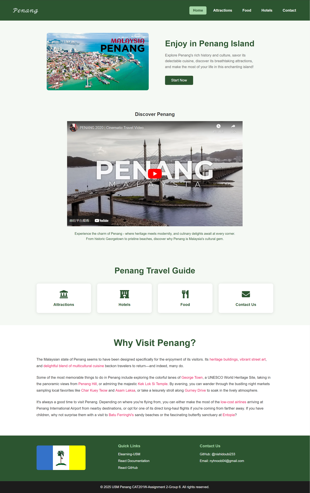

## Project Overview

This project is the second assignment for the CAT201 course. Its purpose is to practice and master front-end page development and interaction logic. By working on this assignment, you will learn how to build a complete web page or application using HTML, CSS, and JavaScript, as well as meet the specified requirements.

## Demo Link

https://nishidoubi233.github.io/CAT201-Assignment2/#/

## Optimized for mobile
We strive to provide the best possible browsing experience for our users, regardless of whether they are accessing the site on a desktop or a mobile device. Consequently, our website has been optimized for mobile devices to ensure a smooth and user-friendly experience across various screen sizes.

